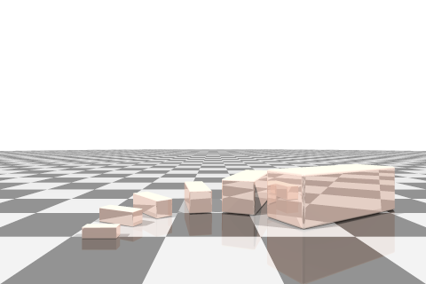
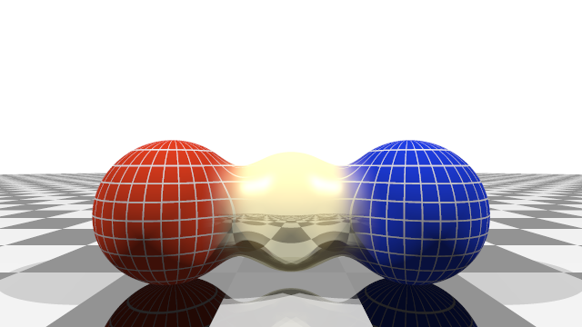
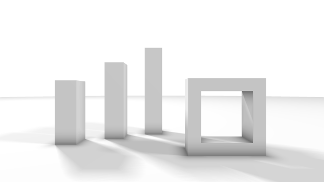

# Jader

> A CPU-based 3D shader implemented entirely in modern Java

Jader is a small experimental project showcasing what is possible with modern, plain Java. It implements a full 3D renderer using [ray marching](https://en.wikipedia.org/wiki/Ray_marching), a technique that represents complex 3D geometry as simple mathematical distance functions.

The project emphasizes a clean and minimal code structure, focusing on readability and modern Java language features, while still achieving surprisingly good rendering quality and performance for a pure Java implementation.

Jader does not rely on native code or GPU shaders, everything runs on the JVM.

**Requirements:**

* Java 25 or newer

## Examples

The following [example scenes](src/main/java/jader/ui/ExampleScenes.java) show the visual capabilities of Jader:

### Lights, Shadows and Reflections

### Primitive Shapes

### Affine Transformations

### Boolean Operations: Intersection, Subtraction, Union

### Smooth Union and Subtraction

### Smooth Union with Surface Blending

### Soft Shadows and Ambient Occlusion

### Additive Color Mixing

TODO

## Background Information:

If you want to learn more about the algorithms use for 3D rendering with ray marching the following sources provide great background information:

* [Painting with Math: A Gentle Study of Raymarching, Maxime Heckel, 2023](https://blog.maximeheckel.com/posts/painting-with-math-a-gentle-study-of-raymarching/)
* [Ray Tracing in One Weekend, Steve Hollasch](https://raytracing.github.io/)
* [Video Ray Marching, and making 3D Worlds with Math, SimonDev, 2022](https://youtu.be/BNZtUB7yhX4)
* [Distance Function, Inigo Quilez](https://iquilezles.org/articles/distfunctions/)
* [Soft Shadows in Raymarched SDFs, Inigo Quilez, 2010](https://iquilezles.org/articles/rmshadows/)
* [Volumetric Rendering: Ambient Occlusion, Alan Zucconi, 2016](https://www.alanzucconi.com/2016/07/01/ambient-occlusion/)

## Ideas for Future Features

* Shape Repetition
* Textures
* Height Maps
* Fog
* Render Animations
* UI with Viewpoint Interaction
* UI with Animation Interaction
* UI with Progressive Rendering
* Optionally add performance info to rendered images
* "3D Live Coding"
* Point Light Decay
* Spot Lights

## Credits

The initial idea to implement ray marching in pure Java was inspired by [JRender](https://github.com/nbrugger-tgm/JRender).

